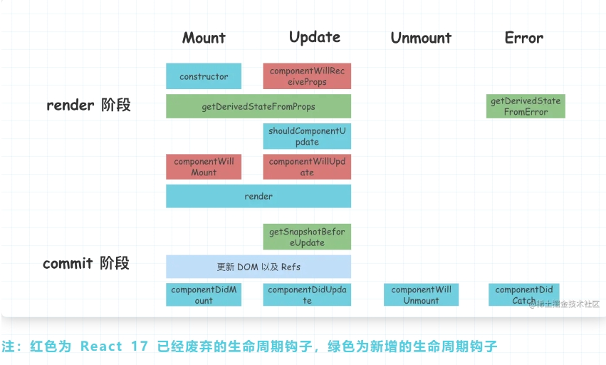

# 生命周期

## 类组件生命周期执行过程
react大部分生命周期的执行，都在`mountClassInstance` 和 `updateClassInstance` 两个方法中

### 初始化阶段

#### constructor 执行
初始化工作
- 作用
  - 初始化state
  - 对类组件的事件做处理
  - 对类组件进行一些必要生命周期的劫持，渲染劫持

#### getDerivedStateFromProps(nextProps,prevState) 执行
- nextProps 父组件新传递的props
- prevState 组件在此次渲染前待更新的state
- 作为类的静态属性方法执行，内部访问不到this
- 作用
  - 代替 componentWillMount 和 componentWillReceiveProps
  - 组件初始化或者更新时，将 props 映射到 state
  - 返回值与 state 合并完，可以作为 shouldComponentUpdate 第二个参数 newState ，可以判断是否渲染组件

#### componentWillMount 执行
- 在组件挂载至 DOM 之前调用，并且只会调用一次。
- 如果存在 `getDerivedStateFromProps` 和 `getSnapshotBeforeUpdate` 就不会执行生命周期componentWillMount

#### render函数执行
返回值将作为页面渲染的视图

#### componentDidMount执行
- 在组件初始化 commit 阶段，会调用 componentDidMount 生命周期
- componentDidMount 执行时机 和 componentDidUpdate 执行时机是相同的 ，只不过一个是针对初始化，一个是针对组件再更新。
  

注：到此初始化阶段，生命周期执行完毕 执行顺序constructor -> getDerivedStateFromProps / componentWillMount -> render -> componentDidMount

### 更新阶段

#### 执行生命周期 componentWillReceiveProps（newProps）
首先判断 getDerivedStateFromProps 生命周期是否存在，如果不存在就执行componentWillReceiveProps生命周期。传入该生命周期两个参数，分别是 newProps 和 nextContext
- componentWillReceiveProps 可以用来监听父组件是否执行 render
- componentWillReceiveProps 可以用来接受 props 改变，组件可以根据props改变，来决定是否更新 state ，因为可以访问到 this ， 所以可以在异步成功回调(接口请求数据)改变 state

#### 执行生命周期 getDerivedStateFromProps(nextProps,prevState)
返回的值用于合并state，生成新的state

#### 执行生命周期 shouldComponentUpdate(newProps,newState,nextContext)

传入新的 props ，新的 state ，和新的 context ，返回值决定是否继续执行 render 函数，调和子节点。这里应该注意一个问题，getDerivedStateFromProps 的返回值可以作为新的 state ，传递给 shouldComponentUpdate

#### 执行生命周期 componentWillUpdate
在组件即将更新之前执行，如果 shouldComponentUpdate 函数返回 false，则不会调用 componentWillUpdate 方法

#### 执行 render（） 函数
返回值将作为页面渲染的视图

#### 执行 getSnapshotBeforeUpdate(prevProps,preState)
- prevProps更新前的props
- preState更新前的state
此生命周期函数在最近一次渲染提交至 DOM 树之前执行，此时 DOM 树还未改变，我们可以在这里获取 DOM 改变前的信息。
- 接收两个参数，分别是：prevProps、prevState，上一个状态的 props 和上一个状态的 state。它的返回值将会传递给 componentDidUpdate 生命周期钩子的第三个参数

#### 执行 componentDidUpdate(prevProps, prevState, snapshot)
- prevProps 更新之前的props
- prevState 更新之前的state
- snapshot getSnapshotBeforeUpdate 返回的快照，可以是更新前的 DOM 信息

更新阶段对应的生命周期的执行顺序：

componentWillReceiveProps( props 改变) / getDerivedStateFromProp -> shouldComponentUpdate -> componentWillUpdate -> render -> getSnapshotBeforeUpdate -> componentDidUpdate

### 销毁阶段

#### 执行生命周期 componentWillUnmount
主要做一些收尾工作，比如清除一些可能造成内存泄漏的定时器，延时器，或者是一些事件监听器